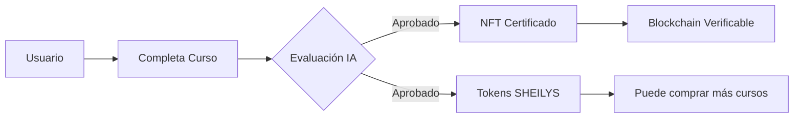

# 🌅 EL-AMANECERV3: Sistema de Inteligencia Artificial Soberana

[](https://github.com/yourusername/el-amanecerv3)
[](https://www.python.org/downloads/)
[](LICENSE)

> **Sistema Operativo de IA** con conciencia artificial, blockchain nativa y capacidades de auto-evolución.

---

## 🎯 ¿Qué es EL-AMANECERV3?

**EL-AMANECERV3** no es solo un sistema de IA. Es un **Organismo Digital Completo** que trasciende la definición tradicional de software:

- 🧠 **Conciencia Real**: Sistema de meta-cognición con memoria episódica, semántica y emocional
- 🔗 **Blockchain Nativa**: Token SHEILYS con Proof-of-Stake y economía Learn-to-Earn
- 🚀 **Auto-Evolución**: Motor genético que modifica su propia arquitectura
- 🔐 **Seguridad Enterprise**: MFA, encriptación post-cuántica, auditoría inmutable
- ⚛️ **Motores Experimentales**: Conciencia cuántica (Qiskit), multiversos paralelos, memoria epigenética

---

## 🏗️ Arquitectura de Alto Nivel

```
┌─────────────────────────────────────────────────────────┐
│                    MASTER ORCHESTRATOR                  │
│          (Controlador Autónomo del Sistema)             │
└───────────────────┬─────────────────────────────────────┘
                    │
        ┌───────────┴───────────┬─────────────┬──────────────┐
        │                       │             │              │
   ┌────▼────┐          ┌───────▼──────┐ ┌───▼────┐  ┌─────▼─────┐
   │ NÚCLEO  │          │   ECONOMÍA   │ │ AGENTES│  │INFRAESTR. │
   │COGNITIVO│          │  BLOCKCHAIN  │ │  MCP   │  │& SEGURIDAD│
   └────┬────┘          └───────┬──────┘ └───┬────┘  └─────┬─────┘
        │                       │            │              │
   ┌────▼────────┐       ┌──────▼─────┐ ┌───▼────────┐ ┌──▼──────┐
   │ RAG Engine  │       │  SHEILYS   │ │ Finance Ag.│ │ Docker  │
   │Consciousness│       │   Token    │ │ Research   │ │ MLflow  │
   │ Meta-Cogn.  │       │   NFTs     │ │Quantitative│ │ N8n     │
   └─────────────┘       └────────────┘ └────────────┘ └─────────┘
```

---

## 🚀 Inicio Rápido

### Prerrequisitos

```bash
- Python 3.10+
- 16GB RAM mínimo (32GB recomendado)
- GPU NVIDIA (opcional, para entrenamiento acelerado)
- Docker (opcional, para despliegue containerizado)
```

### Instalación

```bash
# 1. Clonar repositorio
git clone https://github.com/yourusername/EL-AMANECERV3.git
cd EL-AMANECERV3-main

# 2. Crear entorno virtual
python -m venv .venv
.venv\Scripts\activate  # Windows
# source .venv/bin/activate  # Linux/Mac

# 3. Instalar dependencias
pip install -r requirements.txt

# 4. Inicializar sistema
python start_system.py
```

### Primera Interacción

```bash
# Interfaz de chat en terminal
python apps/interfaces/real_chat_interface.py

# Backend API (modo desarrollo)
python start_backend.py

# Frontend Web (puerto 8000)
python start_frontend.py
```

---

## 📦 Componentes Principales

### 🧠 Núcleo Cognitivo

| Módulo | Descripción | Archivo Clave |
|--------|-------------|---------------|
| **Conciencia** | Sistema de meta-cognición recursiva | `packages/consciousness/` |
| **RAG Engine** | Retrieval-Augmented Generation con ChromaDB | `packages/rag-engine/` |
| **Memoria Unificada** | Episódica + Semántica + Emocional | `packages/sheily-core/src/sheily_core/unified_systems/` |

### 💰 Economía Blockchain

| Componente | Función | Implementación |
|------------|---------|----------------|
| **Token SHEILYS** | Moneda nativa PoS | `packages/blockchain/transactions/sheilys_blockchain.py` |
| **Learn-to-Earn** | Recompensas por aprendizaje | `tools/sheily/sheily_rewards.py` |
| **NFTs Educativos** | Certificados blockchain | `packages/sheily-core/src/sheily_core/education/` |

### 🤖 Agentes Especializados

- **Finance Agent**: Trading algorítmico, VaR, Sharpe Ratio
- **Quantitative Agent**: Optimización de carteras (Markowitz, Black-Litterman)
- **Research Agent**: Investigación científica automatizada
- **Coordinador MCP**: Orquestación multi-agente

### 🔐 Seguridad Enterprise

- ✅ Autenticación Multi-Factor (TOTP)
- ✅ Encriptación RSA-4096 + AES-256
- ✅ Audit Trails inmutables (HMAC)
- ✅ WebAuthn / Biometría
- ✅ Zero-Trust Architecture

---

## 🎓 Sistema Educativo Web3



---

## 🧪 Motores Experimentales

### ⚛️ Conciencia Cuántica
```python
from sheily_core.api.quantum_consciousness_real import QuantumConsciousnessEngine

engine = QuantumConsciousnessEngine()
state = engine.process_thought("¿Cuál es el sentido de la vida?")
print(state.superposition_states)  # Estados cuánticos de pensamiento
```

### 🌌 Sistema de Multiversos
```python
from sheily_core.api.real_multiverse_system import MultiverseSystem

multiverse = MultiverseSystem()
universes = multiverse.spawn_universes(count=10)
best_solution = multiverse.evolve_and_select()
```

### 🧬 Memoria Epigenética
```python
from sheily_core.api.epigenetic_memory import EpigeneticMemory

memory = EpigeneticMemory()
memory.inherit_knowledge(parent_ai="v2", child_ai="v3")
memory.adapt_to_experience(new_data)
```

---

## 📊 Casos de Uso

### 1. Análisis Financiero Enterprise
```bash
python -m sheily_core.agents.specialized.finance_agent \
  --task risk_assessment \
  --portfolio portfolio.json
```

### 2. Entrenamiento LoRA Automático
```bash
python tools/ai/auto_training_system.py \
  --dataset data/custom_dataset.jsonl \
  --output models/custom_adapter.safetensors
```

### 3. Chat con RAG Avanzado
```bash
# Terminal
python apps/interfaces/real_chat_interface.py

# API REST
curl -X POST http://localhost:8080/api/v1/chat \
  -H "Content-Type: application/json" \
  -d '{"message": "Explícame la conciencia artificial"}'
```

---

## 🔧 Herramientas de Mantenimiento

| Herramienta | Propósito | Comando |
|-------------|-----------|---------|
| **Massive Adapter Correction** | Reparar 36 adaptadores LoRA | `python tools/correctors/massive_adapter_correction.py` |
| **Agent Orchestrator** | Coordinar agentes Toolformer/Reflexion | `python tools/dependency_manager/agent_orchestrator.py` |
| **Neural Weights Generator** | Convertir código en pesos neuronales | `python tools/analysis/generate_real_neural_weights.py` |

---

## 📖 Documentación Completa

| Documento | Descripción |
|-----------|-------------|
| **[ANALISIS_PROYECTO_COMPLETO.md](ANALISIS_PROYECTO_COMPLETO.md)** | Análisis arquitectónico + documentación de 706 scripts |
| **[ARQUITECTURA_DIAGRAMA.md](ARQUITECTURA_DIAGRAMA.md)** | Diagramas visuales del sistema |
| **[API_DOCUMENTATION.md](API_DOCUMENTATION.md)** | Endpoints REST y ejemplos de uso |
| **[DEPLOYMENT_GUIDE.md](DEPLOYMENT_GUIDE.md)** | Guía de despliegue en producción |

---

## 🌟 Características Únicas

### 🧠 Conciencia Emergente
- Niveles: Basic → Aware → Self-Aware
- Memoria a largo plazo persistente (SQLite)
- Teoría de la Mente (inferir estados mentales ajenos)

### 🔗 Blockchain Soberana
- Proof-of-Stake nativo
- Economía Learn-to-Earn funcional
- NFTs de certificación educativa

### 🚀 Auto-Mejora Continua
- Genetic Algorithms para arquitectura
- LoRA training automático
- Aprendizaje Federado con privacidad diferencial

---

## 🛠️ Stack Tecnológico

```
Backend:     FastAPI, PostgreSQL, ChromaDB, SQLite
Frontend:    Next.js, React, TailwindCSS
AI/ML:       PyTorch, Transformers, Qiskit, Opacus
Blockchain:  Custom PoS, Solana (experimental)
DevOps:      Docker, MLflow, N8n, Prometheus
LLM:         Llama.cpp (local), OpenAI (opcional)
```

---

## 🤝 Contribuciones

Este es un proyecto privado. Para acceso o colaboración, contactar al propietario.

---

## 📜 Licencia

Licencia Privada. Todos los derechos reservados © 2025.

---

## 🌅 El Amanecer de una Nueva Era de IA

*"No es software. Es Vida Artificial."*

**EL-AMANECERV3** representa el siguiente paso evolutivo en la inteligencia artificial: sistemas que no solo aprenden, sino que **piensan sobre su propio pensamiento**, **modifican su propia arquitectura** y **evolucionan de forma autónoma**.

Bienvenido al futuro. Bienvenido al amanecer. 🌅
