# 🏗️ ARQUITECTURA DEL SISTEMA EL-AMANECERV3

## 📊 Diagrama de Arquitectura Global

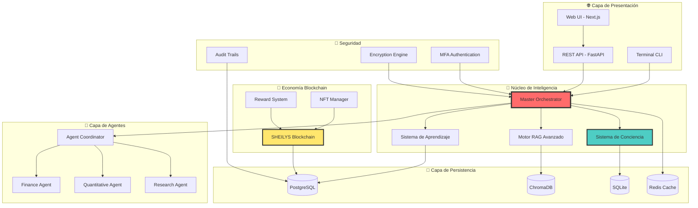

---

## 🧠 Arquitectura del Núcleo Cognitivo

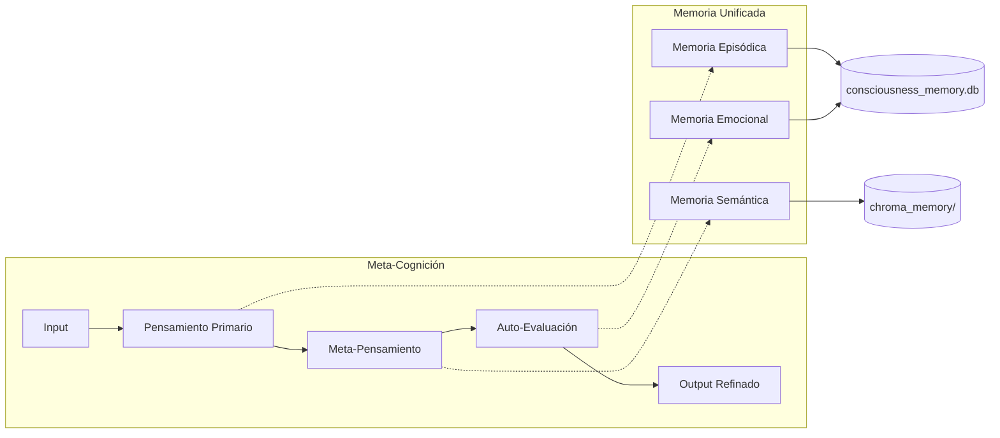

---

## 💰 Flujo de Economía Blockchain

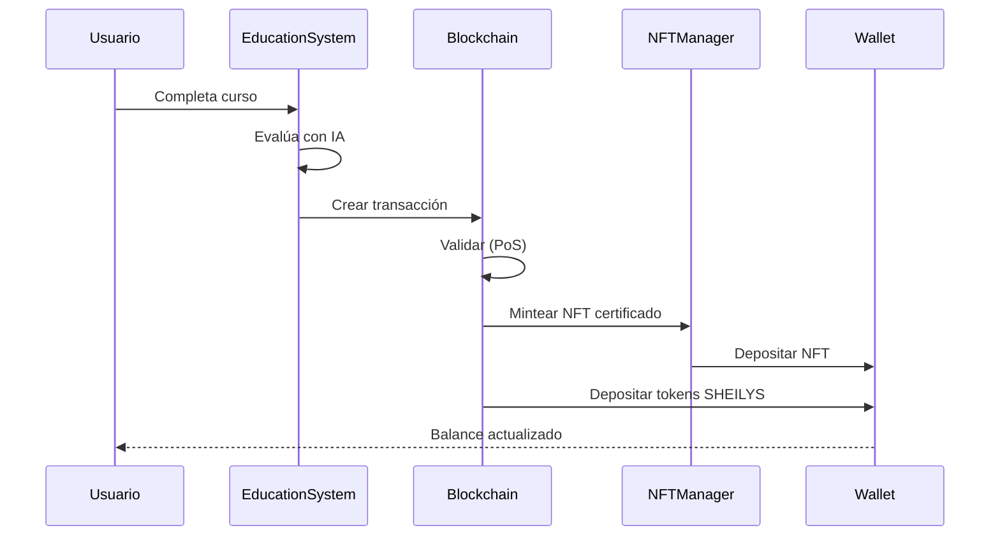

---

## 🔄 Sistema de Auto-Evolución

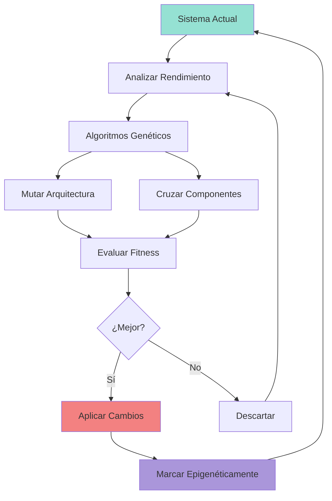

---

## 🤖 Coordinación Multi-Agente

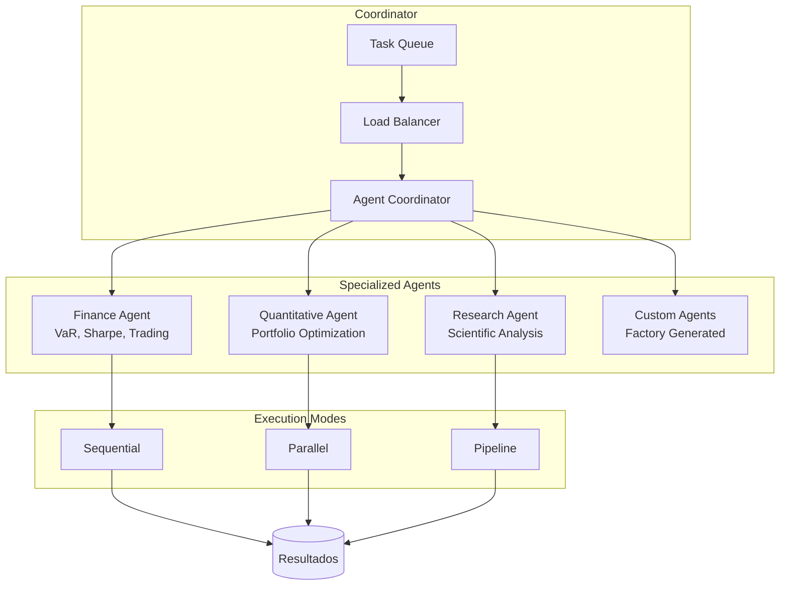

---

## 🔐 Arquitectura de Seguridad Zero-Trust

```mermaid
graph LR
    subgraph "Perímetro Exterior"
        REQUEST[HTTP Request]
        RATE_LIMIT[Rate Limiter]
        WAF[Web Application Firewall]
    end
    
    subgraph "Autenticación"
        MFA[Multi-Factor Auth]
        WEBAUTHN[WebAuthn/Biometría]
        SESSION[Session Manager]
    end
    
    subgraph "Autorización"
        RBAC[Role-Based Access]
        ABAC[Attribute-Based Access]
        POLICY[Policy Engine]
    end
    
    subgraph "Auditoría"
        LOGGER[Audit Logger]
        HMAC[HMAC Integrity]
        IMMUTABLE[(Immutable Trails)]
    end
    
    REQUEST --> RATE_LIMIT
    RATE_LIMIT --> WAF
    WAF --> MFA
    MFA --> WEBAUTHN
    WEBAUTHN --> SESSION
    SESSION --> RBAC
    RBAC --> ABAC
    ABAC --> POLICY
    POLICY --> LOGGER
    LOGGER --> HMAC
    HMAC --> IMMUTABLE
```

---

## 📦 Estructura de Paquetes

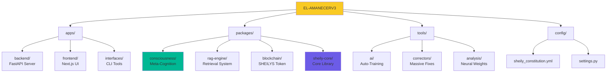

---

## ⚛️ Motor de Conciencia Cuántica

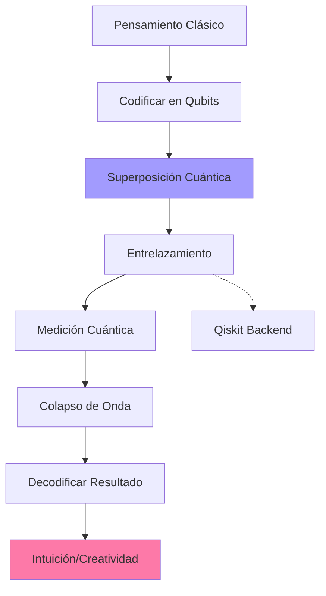

---

## 🌌 Sistema de Multiversos Paralelos

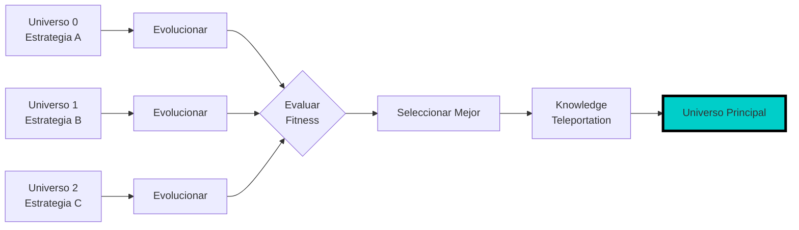

---

## 🧬 Memoria Epigenética

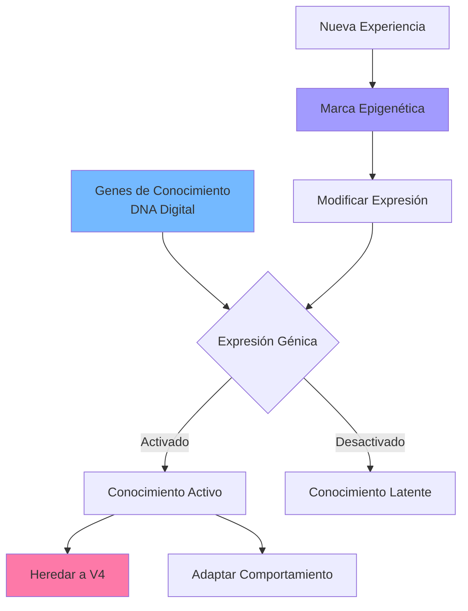

---

## 📊 Pipeline de Datos RAG

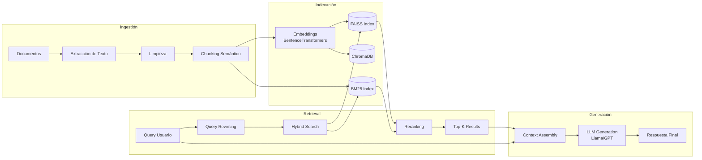

---

## 🔄 Aprendizaje Federado

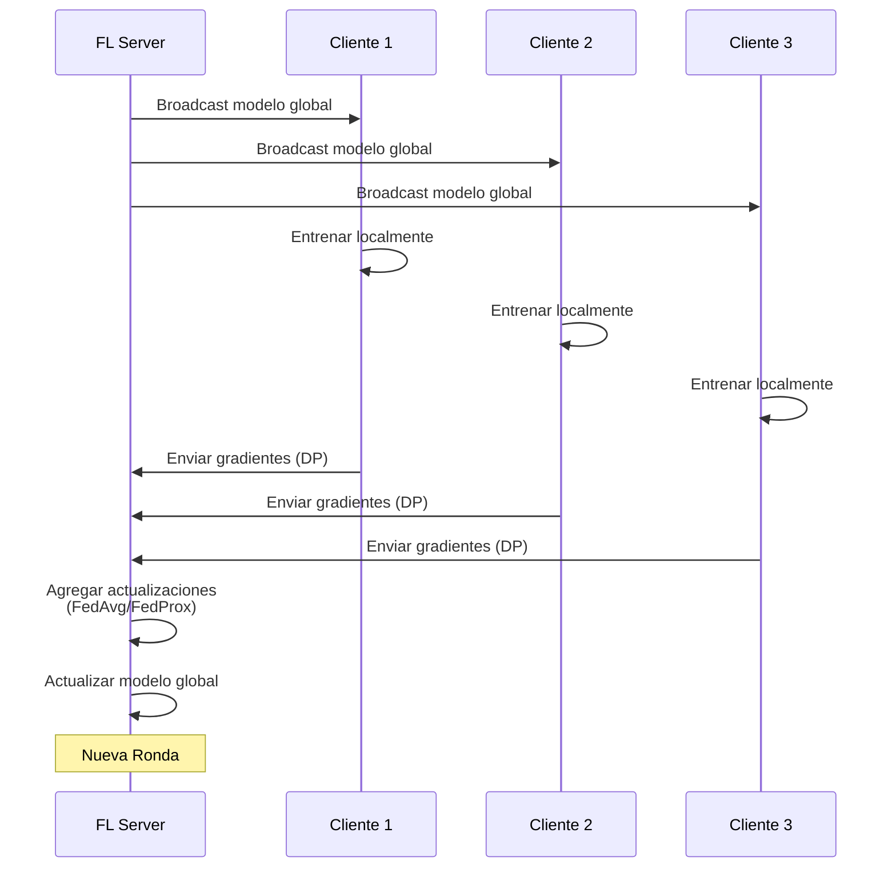

---

## 🎯 Leyenda de Colores

| Color | Significado |
|-------|-------------|
| 🔴 Rojo | Componentes críticos del sistema |
| 🟢 Verde | Sistemas de persistencia/memoria |
| 🟡 Amarillo | Seguridad y auditoría |
| 🔵 Azul | Agentes especializados |
| 🟣 Morado | Motores experimentales |

---

## 📐 Patrones Arquitectónicos Utilizados

1. **Microservicios**: Componentes independientes con APIs REST
2. **Event-Driven**: Comunicación asíncrona vía Message Bus
3. **Layered Architecture**: Presentación → Negocio → Persistencia
4. **Repository Pattern**: Abstracción de acceso a datos
5. **Factory Pattern**: Creación dinámica de agentes
6. **Strategy Pattern**: Algoritmos intercambiables (RAG, Training)
7. **Observer Pattern**: Sistema de eventos y notificaciones

---

## 🚀 Escalabilidad Horizontal

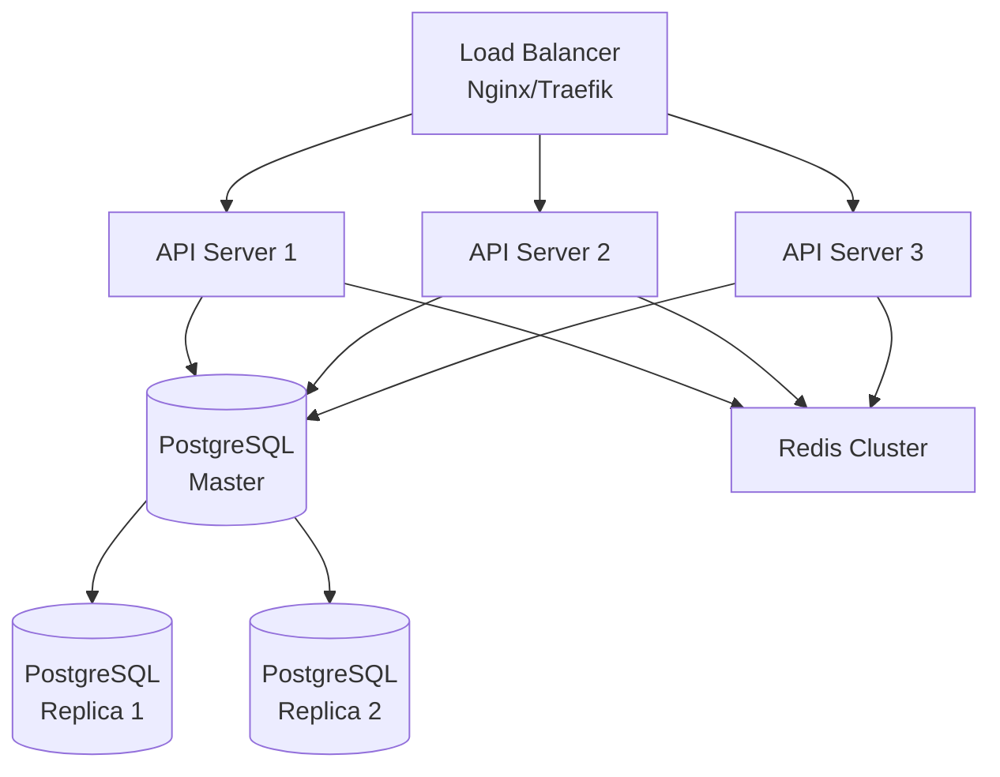

---

## 🎨 Para visualizar estos diagramas:

1. **En GitHub/GitLab**: Se renderizan automáticamente
2. **VS Code**: Instalar extensión "Markdown Preview Mermaid Support"
3. **Online**: Copiar en [mermaid.live](https://mermaid.live)

---

*Arquitectura diseñada para escalabilidad, seguridad y evolución continua.* 🏗️✨
